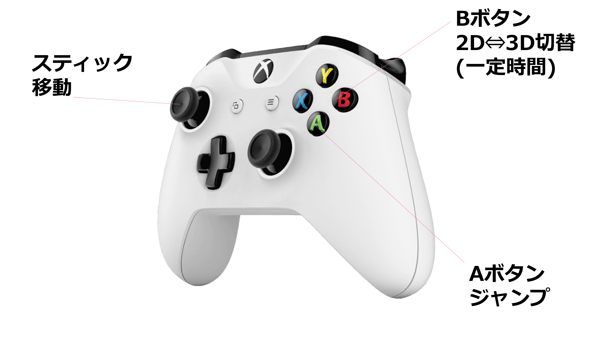

# DimensionFlip 
## 河原電子ビジネス専門学校 ゲームクリエイター科2年  山口 隼 (やまぐち はやと) 27卒 

# 目次
## 1. [作品概要](#作品概要)
## 2. [ゲーム内容](#ゲーム内容)
## 3. [操作説明](#操作説明)
## 4. [技術説明](#技術説明)
## &emsp; 4-1[StrategyPattern](#StrategyPattern)
## &emsp; 4-2[FactoryPattern](#FactoryPattern)

## 5. [こだわり](#こだわり)
## 6. [その他使用技術](#その他使用技術)
## &emsp; 6-1[StatePattern](#statepattern)
## &emsp; 6-2[SingletonPatter](#singletonpattern)
## &emsp; 6-3[ObserverPattern](#Observerpattern)
## 7. [今後の展望](#今後の展望)
## 8. [リンク集](#リンク集)

# 作品概要
* **開発環境**:  Visual Studio 2022 , GitHub,  Fork  
* **ジャンル**: 2次元（2D）と3次元（3D）のカメラ視点を動的に切り替えてステージを攻略するアクションゲーム  
* **使用言語**:  C++   C  
* **対応ハード**:  PC Windows11  , Xbox系コントローラー  
* **プレイ人数**: 1人   
* **開発期間**: 2025年9月 〜 現在進行中  
---

# ゲーム内容

## 時には2D、またある時には3D。 カメラの視点を回してステージを突き進もう。 

##  ステージの最奥。アナタを待つものとは!? 
---

# 操作方法

# 技術説明
## StrategyPattern
* 作品内での使用箇所 : 2D/3Dカメラの切り替えロジック

### ■ 実装背景
* 2D/3Dカメラとではカメラの見え方の計算方法が異なるためです。
* また、一つの「カメラクラス」にそれぞれの〇Dカメラの処理を書いてしまうと 
 大きなカメラクラスとなってしまい、クラスが肥大化をしてしまうためです。 

### ■ 導入成果
* **単一責任の原則の遵守**: 各視点ロジックを独立したクラスへ分離し、構造の視認性を向上させました。
* **保守性の向上**: クラス間の独立性が確保されたため、一方の変更が他方に影響を与えず、新しいカメラ挙動の追加も容易になりました。

---

## FactoryPattern
* 作品内での使用箇所:  敵キャラクターの生成方式

### ■ 導入背景
* 敵の種類が増えるたびにステージクラスが肥大化し、生成処理の拡張性やメンテナンスのしずらさが問題となっていました。

### ■ 導入成果
* **責任の集約**: インスタンス化および初期パラメータ設定の責任を `EnemyFactory` に集約しました。
* **抽象化**: ステージ側は具体的な敵クラスの詳細を知る必要がなくなり、`EnemyType` と `座標` の指定のみで生成が可能になりました。

### ■ 技術的な工夫：関数テーブルの実装
* **実行効率の最適化 ($O(1)$)**: 従来の `switch` 文による条件分岐を排除し、関数ポインタを用いた「関数テーブル（`std::array`）」方式を採用しました。これにより、敵の種類数に関わらず定数時間での生成が可能です。
    
* **静的安全性の確保 (`static_assert`)**: `static_assert` を導入し、列挙型の要素数とテーブルサイズの一致をコンパイル時に検証しています。登録漏れをビルド段階で検知することで、実行時のクラッシュを未然に防いでいます。
---

## . その他使用技術
* **シングルトンパターン**: アクセスポイントを提供し呼び出し元を1つに統一しました。
* **ステートパターン**: プレイヤーの状態遷移をクラス単位で管理し、複雑な挙動を整理しました。
* **オブザーバーパターン**: ステージギミックとなるオブジェクトのコリジョンのON/OFFを制御しています。

---
## . 今後の展望
* **演出面の強化 (UX向上)**: カメラワークを通じてユーザーに「視点切替のタイミング」を直感的に伝える演出を導入します。
* **レベルデザインの完遂**: 1つのステージとしての完成度を高めるため、ボス戦のロジック構築に注力します。

---
## リンク
* **Youtube** <a href="https://youtu.be/g3JOp4OgxHA" target="_blank">https://youtu.be/g3JOp4OgxHA</a>

* **GitHub**  <a href="https://github.com/YamaguchiHayato/Dimensional-Flip" target= "_blank"> https://github.com/YamaguchiHayato/Dimensional-Flip </a>
 

 

