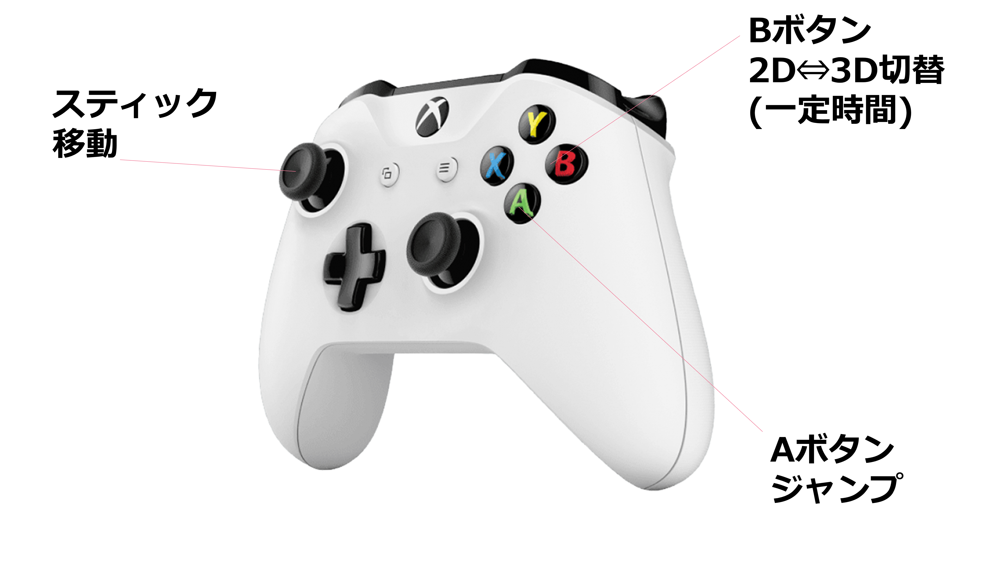

<link rel="stylesheet" href="style.css">

# DimensionFlip 
## 河原電子ビジネス専門学校 ゲームクリエイター科2年  山口 隼 (やまぐち はやと) 27卒

## gif.1 タイトル画面。
 

# 目次
### 1. [作品概要](#作品概要)
### 2. [ゲーム内容](#ゲーム内容)
### &emsp; 2-2 [ゲームの流れ](#ゲームの流れ)        
### &emsp; 2-3 [各ステージについて](#2-3-各ステージについて)
### 3. [操作説明](#操作説明)
### 4. [カメラについて](#カメラについて)
### 5. [技術説明](#技術説明)
### &emsp; 5-1[StrategyPattern](#StrategyPattern)
### &emsp; 5-2[FactoryPattern](#FactoryPattern)
### 6. [その他使用技術](#その他使用技術)
### &emsp; 6-1[StatePattern](#Statepattern)
### &emsp; 6-2[SingletonPatter](#singletonPattern)
### 7. [今後の展望](#今後の展望)
### 8. [リンク集](#リンク)
 

# 作品概要
* ## 開発環境:  &emsp; Visual Studio 2022 , &emsp; GitHub,  &emsp; Fork 
  
* ## ジャンル:  &emsp;2次元（2D）と3次元（3D）のカメラ視点を動的に切り替えるアクションゲーム

* ## 使用言語:  &emsp; C++  
* ## 対応ハード:  &emsp;PC Windows11 &emsp;Xbox系コントローラー 
* ## プレイ人数:  &emsp; 1人 
* ## 開発期間:  &emsp;2025年9月 〜 現在進行中 
---
 

# ゲーム内容

## 時には2D、またある時には3D。 カメラの視点を回してステージを突き進もう。 カメラの使い方はアナタ次第!!  はたしてあなたはどう回す!?

## gif.2 ボスの登場カットイン

## ステージの最奥。 アナタを待つものとは一体！？
---
 

 

# ゲームの流れ

<video src="./Portfolio_Video\titleAction_StageSelectScene.mp4" controls width="100%"></video>

## video.1 タイトルアクション操作
## タイトルには3つの操作ができます。　
## GameStart を押すとステージ選択画面に遷移することができ遊びたいステージを選択することができます。
## Manual は操作説明です。　本作品はチュートリアルで操作説明はしていますが、タイトル画面からも確認できるように実装しました。
## GameEnd はゲームを終了できます。　逐一右上の✖を押してウィンドウを閉じるのはストレスになると思ったkらです。
## 少し細かいですが、画面下部には権利クレジットとVersion表記を記載しています。
## これはより「ゲームっぽさ」を表現するために記載を行いました。
 
 

# 各ステージについて

## ステージの種類は3種類あります。
## TutorialStage, Stage1(NormalStage), BossStageです。
## ここからは Tutorial, Normal, Bossと表記します。

 

## Tutorialではゲーム全体の流れと遊び方を学ぶことができます。
<video src = "./Portfolio_Video\PlayTutorialStage.mp4" controls width = "100%"></video>

 

## Normalでは実際にギミックや視点切替を行いながらステージを進んでいく必要があります。
## また、敵も出現するため、カメラを切り替えるタイミングが重要になってきます。
<video src = "./Portfolio_Video\PlayNormalStage.mp4" controls width = "100%"></video>

 

## Bossではカメラを切り替えながら、攻撃を避け、ボスに攻撃を与える必要があります。
## ボス戦の攻略チャートは別でアップロードしています。　
* ** ボス戦のチャートはこちらになります ** <a href="https://youtu.be/FVOEsfokTfM?si=VaxhHGj84BB05cHO" target="_blank">https://youtu.be/FVOEsfokTfM?si=VaxhHGj84BB05cHO</a>

 

# 操作方法

 

---

# カメラについて

 
  ##  カメラ本体を画面中央に配置しPlayerが追従ラインを上下した分だけ追従するように実装
  ##  &ensp; → ステージ全体を見渡すことがき、ゲームとしての視認性を確保。
  ##  &ensp; &ensp; 斜面の計算にも対応し、進行につれ上がる視覚を追従するように実装。

 

# 技術説明

# StrategyPattern
## 作品内での使用箇所 : 2D/3Dカメラの切り替えロジック

## ■ 実装背景
  ## 「カメラクラス」の肥大化を防ぐためです。
  ##  &ensp; → 既存の設計では1つのクラスに機能のすべてのコードを記載しており、
  ##  &emsp; &ensp; 可読性・保守性の観点から将来性がないと判断。
  ##  &emsp; &ensp; そこでStrategyPatternの特徴「アルゴリズムの動的な切り替え」に着目し
  ##  &emsp; &ensp; 2D/3D用カメラクラスを作成。 振る舞いとして実装を行うことが出来ました。
  ##  &emsp; &ensp; また、メンテナンス性も向上。 片方のクラスを変更しても影響を受けないため、
  ##  &emsp; &ensp; そのカメラ特有の機能を実装したいときに役立ちました。
---
 

# FactoryPattern
## 作品内での使用箇所:  敵キャラクターの生成方式

### ■ 実装背景
  ##  「敵の種類」が増加するたびに増えるSwitch文コードの可読性向上のため。
  ##  &ensp; → 敵の種類が増えるたびに SwitchCase文を多用し、コードが長くなってしまうと判断。
  ##  &emsp; &ensp; また、そこに敵特有の初期化処理も増え、大きくなってしまうと判断。
  ##  &emsp; &ensp; 既存の実装方法ではステージクラスにその処理を書きステージクラスが肥大化。
  ##  &emsp; &ensp; そこでFactoryPatternを用い、生成の権利をFactoryクラスに譲渡。
  ##  &emsp; &ensp; また、関数テーブルを用いることでSwitch文を廃止。 
  ##  &emsp; &ensp; ステージクラスでは敵の種類と生成座標を指定するだけで生成が可能に。
  ##  &emsp; &ensp; これより 疎結合化・実行速度の向上・コンパイル時の安全性の確保など。
  ##  &emsp; &ensp; 様々な恩恵を獲することに成功。
---
 

## その他使用技術
# SingletonPattern: 
  ##  アクセスポイントを提供し呼び出し元を1つに統一しました。
  ##  主に何か共通の処理をまとめるマネージャクラスに適応。

  

# StatePattern: 
   ##  Playerクラス・Enemyクラスに適応。
   ##  &ensp; → カメラクラスにも適応できたが、あえてStrategyを選択
   ##  &ensp; → 特に処理が複雑なクラスのため適応。
   ##  &emsp; &ensp; 両クラスでは複雑な処理が多い上にメンテナンス性も確保できない。
   ##  &emsp; &ensp; そこで StatePattern を適応することで状態ごとに振る舞いを切り替え、
   ##  &emsp; &ensp; メンテナンス性の向上・迅速なデバッグ対応を行うことに成功。
---
 

## 今後の展望
* ## ステージ選択画面で各ステージのアイコンモデルを作成し、ステージを選択する際重ならないようにします。
* ## ボス戦のガイドも作成予定です。
 

---
## リンク
* **Youtube** <a href="https://youtu.be/_fvf5sKiPTE?si=IzBmCe7CpZoNcOUo" target="_blank">https://youtu.be/g3JOp4OgxHA</a>

 * **過去作品(チーム制作)** <a href="https://youtu.be/8DWuriwGJ-k?si=JC8OAdokIJmdOh5m" target="_blank">https://youtu.be/8DWuriwGJ-k?si=JC8OAdokIJmdOh5m</a>

* **GitHub**  <a href="https://github.com/YamaguchiHayato/Dimensional-Flip" target= "_blank"> https://github.com/YamaguchiHayato/Dimensional-Flip </a>

* **Portfolio**  <a href="https://yamaguchihayato.github.io/DimensionFlip-Portfolio.github.io/" target= "_blank"> https://yamaguchihayato.github.io/DimensionFlip-Portfolio.github.io/ </a>

* **ROM** <a href="https://drive.google.com/file/d/1wA01RpSKpDIp1yL_sSOlJwel9cVUqhps/view?usp=drive_link" target="_blank">ダウンロードはこちら</a>

* **Google ドライブ** <a href = https://drive.google.com/drive/u/1/home target = "https://drive.google.com/drive/u/1/home">こちらからアクセスできます</a>

## 宛先
### 学校法人河原学園 河原電子ビジネス専門学校 ゲームクリエイター科 ゲームコース 3年制
### 2年 山口 隼
* 学内アドレス: CA01244029@st.kawahara.ac.jp

 

