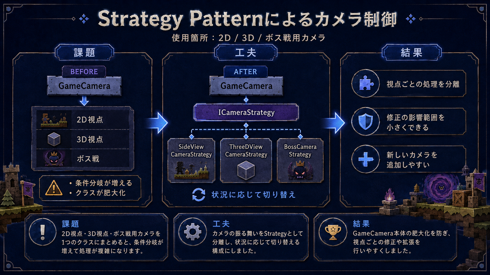

<link rel="stylesheet" href="style.css">

# DimensionFlip

**2D視点と3D視点を切り替え、見え方の違いを使って攻略するアクションゲーム**

  

---

## プロフィール

| 項目 | 内容 |
|---|---|
| 氏名 | 山口 隼（ヤマグチ ハヤト） |
| 所属 | 河原電子ビジネス専門学校 ゲームクリエイター科 27卒 |
| 希望職種 | ゲームプログラマ |
| 使用言語 | C++ |
| 開発環境 | Visual Studio 2022 / 学内エンジン |
| メール | CA01244029@st.kawahara.ac.jp |

### 自己PR

C++を用いたゲーム制作で、ゲームの仕組みを支える実装を得意としています。

主に担当した処理は以下です。
- カメラ制御
- 視点切り替えシステム
- ステージ進行管理
- プレイヤー制御
- 敵生成処理
- 状態管理

本作品では、2D視点と3D視点を切り替えるゲーム性を重視しました。

そのため、カメラ制御とステージ進行を中心に実装しています。

また、実装をするだけでなく、後から修正/追加しやすいように、クラス同士の依存関係の整理を意識しています。

---

## 最初に見てほしいポイント

| 見てほしい内容 | 理由 |
|---|---|
| NormalStage | 2D / 3D視点切り替えを使った攻略要素が最も伝わりやすいため |
| カメラ制御 | 本作品の核となる視点切り替えを支える処理のため |
| 敵生成・状態管理 | 依存関係を整理し、拡張しやすい構成を意識した箇所のため |

---

## 作品概要

| 項目 | 内容 |
|---|---|
| 作品名 | DimensionFlip |
| ジャンル | 2D / 3D視点切り替えアクション |
| 制作形式 | 個人制作 |
| プレイ人数 | 1人 |
| 対応環境 | Windows 11 |
| 推奨操作 | Xbox系コントローラー |
| キーボード操作 | 対応 |
| 開発期間 | 2025年9月 〜 2026年4月 |
| 使用ツール | GitHub / Fork |

---

### どんなゲームか

  

DimensionFlipは、2D視点と3D視点を切り替えながら進むアクションゲームです。

2D視点では、横スクロールに近い感覚でステージを進みます。

3D視点では、奥行き方向への移動や回り込みができます。

視点を切り替えることで、地形の見え方や移動ルートが変化します。

---

### 何が面白いか

  

このゲームの面白さは、同じステージでも視点を変えることで攻略方法が変わることです。

2D視点では進みにくい場所でも、3D視点に切り替えることで奥へ回り込めます。

また、3D視点で地形の位置関係を確認し、2D視点に戻してジャンプアクションを行う場面もあります。

視点切り替えを単なる演出ではなく、移動ルートの発見や障害物の突破に使う攻略要素として実装しました。

---

## ゲーム画面・プレイ内容

### 2D / 3D視点切り替えを使ったステージ進行

  

2D視点では、横方向のアクションを中心に見せています。

3D視点では、奥行き方向のルートや回避経路を確認できます。

### タイトル画面からステージ選択まで

  <video class="portfolio-video" src="./Portfolio_Video/titleAction_StageSelectScene.mp4" controls></video>

タイトル画面では、GameStart、Manual、GameEndを選択できます。

GameStartを選択するとステージ選択画面に進みます。

### TutorialStage

  <video class="portfolio-video" src="./Portfolio_Video/PlayTutorialStage.mp4" controls></video>

TutorialStageでは、移動、ジャンプ、視点切り替えなどを確認できます。

初めてプレイする場合でも、ゲームの基本操作を理解しやすいステージです。

### NormalStage

  

NormalStageでは、2D / 3D視点切り替えを使いながらステージを進みます。

敵やギミックの位置を確認し、どのタイミングで視点を切り替えるかを考えながら攻略します。

本作品の核となる「視点切り替えによる攻略」を最も確認しやすいステージです。

### BossStage

  

BossStageでは、通常ステージとは異なるカメラ制御を使用しています。

視点切り替えと戦闘を組み合わせた体験を目指しています。

ボス戦の解説動画はこちらです。

https://youtu.be/FVOEsfokTfM?si=_2CNayQ2Ri96qFfP

---

## 担当箇所

- 2D / 3D視点切り替えシステムの実装
- カメラ制御の設計・実装
- 視点切り替え許可エリアの管理
- ステージ進行管理
- プレイヤー制御
- 敵キャラクターの生成処理
- ステージごとの遷移処理
- UI・操作説明・ポートフォリオ整理

---

## 技術的に工夫した点

本作品では、デザインパターンを使うこと自体ではなく、処理の依存関係を整理することを重視しました。

目的は、機能追加や修正を行うときの影響範囲を小さくすることです。

| 使用した設計 | 使用箇所 | 目的 |
|---------|--------|---------|
| Strategy Pattern | カメラ制御 | 視点ごとの処理を分離するため |
| Factory Pattern | 敵生成処理 | ステージ側が敵クラスに直接依存しないようにするため |
| State Pattern | Player / Enemy/Bossの状態管理 | 状態ごとの処理を分離するため |

---

### Strategy Patternによるカメラ制御

  

2D視点、3D視点、ボス戦用のカメラはそれぞれ処理が異なります。
したがいまして、1つのクラスに全ての処理を書いてしまうと、クラスの肥大化を引き起こしてしまいます。 
そこで、クラスの振る舞いを切り替えるStrategyPatternに着目し、
2Dカメラクラス、3Dカメラクラスを切り替えて運用しています。　
これにより、片方のカメラを修正しても双方に影響が出ず、運用やメンテナンスが楽になりました。

---

### Factory Patternによる敵生成処理

  

敵の生成処理はステージクラスが直接生成を行わないようにしています。
また、ステージ側では敵の種類と生成座標を指定するだけとし、
敵ごとの生成処理はFactoryクラスで管理を行っています。
これにより敵を追加する際もステージクラスの負担を減らし、配置と生成の責務を分けることができました。

---

### State Patternによる状態管理

  

PlayerやEnemty/Bossの行動処理はステートクラスとして分離を行っています。
本体のクラスは現在の状態を管理し、各ステートクラスはその動きのみをもつ構成となっています。
これにより、メンテナンスを行う際、状態を確認しやすく、追加実装の際も影響範囲を抑えることができました。

---

## 操作方法

  

本作品はXbox系コントローラーでのプレイを推奨しています。

キーボード操作にも対応していますが、操作感はコントローラー基準で調整しています。

### 推奨確認ルート

1. タイトル画面で GameStart を選択
2. ステージ選択画面へ進む
3. TutorialStageを選択
4. 2D / 3D視点切り替えを使った攻略要素を確認
5. 余裕があれば NormalStage と BossStage も確認

---

## 提出・確認情報

| 項目 | 内容 |
|---|---|
| 起動方法 | `Game.exe` を起動してください |
| 推奨環境 | Windows 11 |
| 推奨操作 | Xbox系コントローラー |
| キーボード操作 | 対応 |
| 確認してほしいステージ | TutorialStage |
| 余裕があれば | BossStage |
| 既知の不具合 | 提出時点で把握している進行不能の既知不具合はありません |

---

## 今後の改善予定

- 2D / 3D視点切り替えギミックを、さらにステージ攻略へ結びつける
- BossStageで、視点切り替えによって回避ルートや攻撃チャンスが変化するように調整する
- リファクタリング

---

## リンク

| 種類 | URL |
|---|---|
| YouTube | [プレイ動画はこちら](https://youtu.be/_fvf5sKiPTE?si=IzBmCe7CpZoNcOUo) |
| GitHub | [Dimensional-Flip](https://github.com/YamaguchiHayato/Dimensional-Flip) |
| Portfolio | [DimensionFlip Portfolio](https://yamaguchihayato.github.io/DimensionFlip-Portfolio.github.io/) |
| ROM | [ダウンロードはこちら](https://drive.google.com/file/d/1wA01RpSKpDIp1yL_sSOlJwel9cVUqhps/view?usp=drive_link) |
| 過去作品（チーム制作） | [過去作品動画はこちら](https://youtu.be/8DWuriwGJ-k?si=JC8OAdokIJmdOh5m) |
| 開発中タイトル(GitHub) | [GitHubはこちら](https://github.com/YamaguchiHayato/Project-E.H_MyStorage) |
| 開発中タイトル(Portfolio) | [Portfolioはこちら](https://github.com/YamaguchiHayato/ProjectE.H-Portfolio-Home) |

---

## 宛先

学校法人河原学園 河原電子ビジネス専門学校  
ゲームクリエイター科 ゲームコース 3年制  
3年 山口 隼(ヤマグチ ハヤト)

学内アドレス: CA01244029@st.kawahara.ac.jp