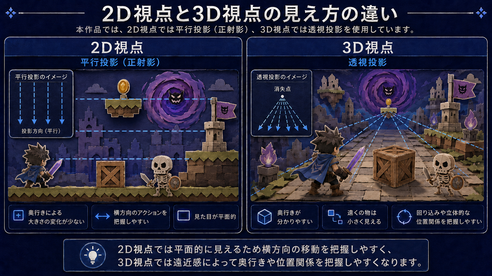
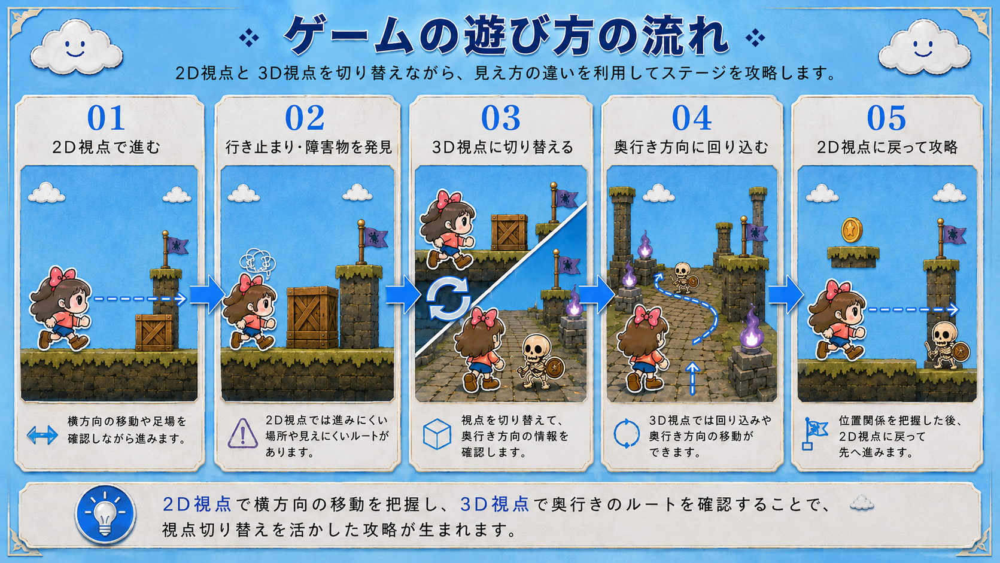
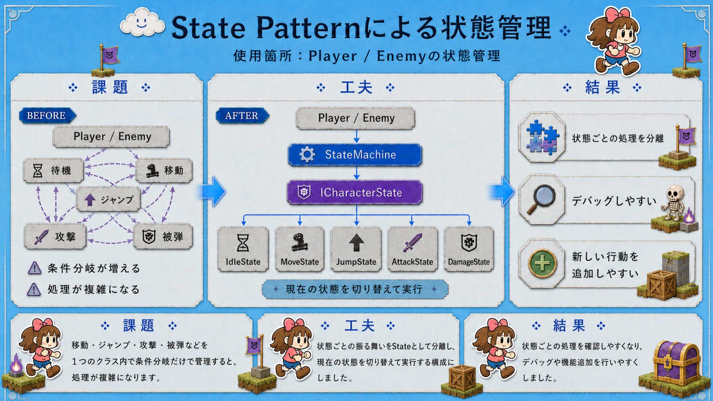
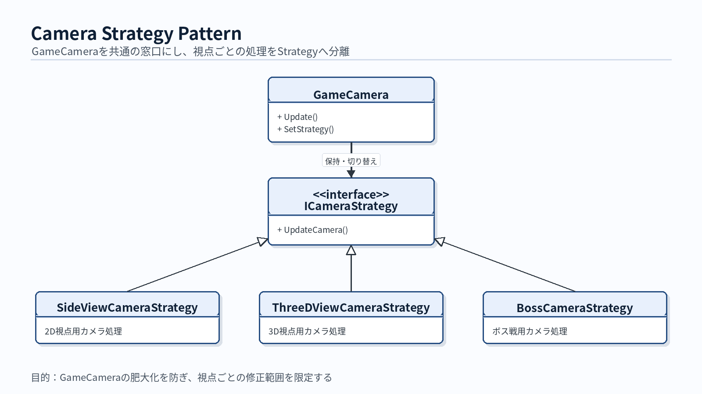
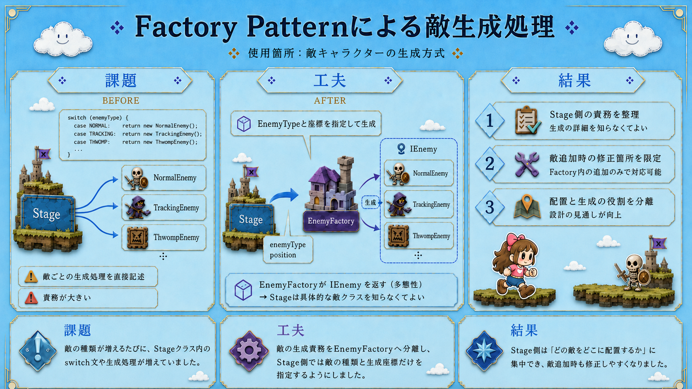
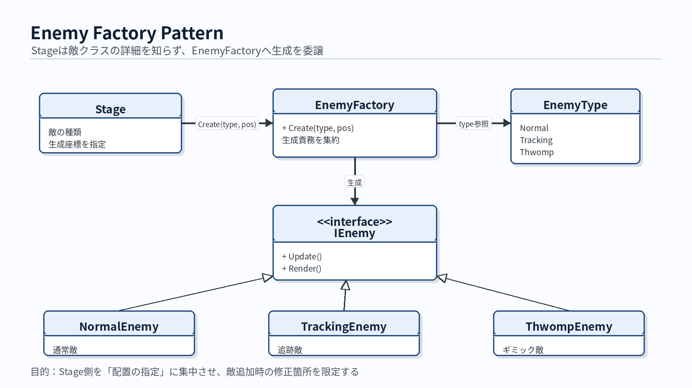
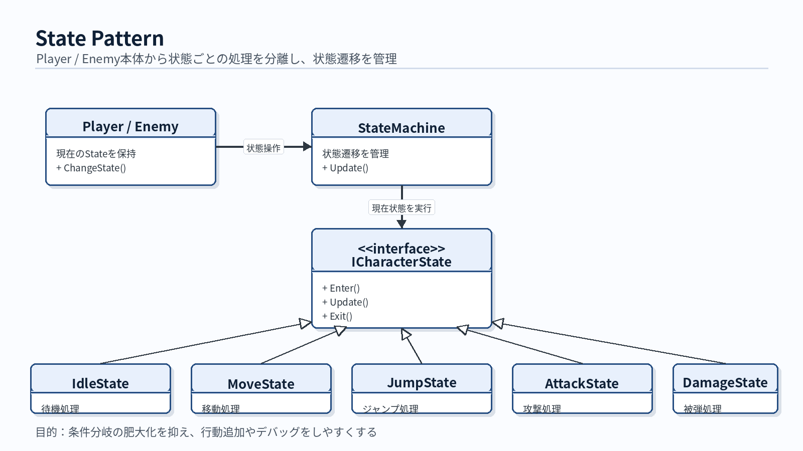

<link rel="stylesheet" href="style.css">

# DimensionFlip

**2D視点と3D視点を切り替え、見え方の違いを使って攻略するアクションゲーム**

---

## プロフィール

| 項目 | 内容 |
|---|---|
| 氏名 | 山口 隼（ヤマグチ ハヤト） |
| 所属 | 河原電子ビジネス専門学校 ゲームクリエイター科 27卒 |
| 希望職種 | ゲームプログラマ |
| 使用言語 | C++ |
| 開発環境 | Visual Studio 2022 / 学内エンジン |
| メール | CA01244029@st.kawahara.ac.jp |

### 自己PR

C++を用いたゲーム制作で、ゲームの仕組みを支える実装を得意としています。

主に担当した処理は以下です。
- カメラ制御
- 視点切り替えシステム
- ステージ進行管理
- プレイヤー制御
- 敵生成処理
- 状態管理

本作品では、2D視点と3D視点を切り替えるゲーム性を重視しました。

そのため、カメラ制御とステージ進行を中心に実装しています。

また、実装をするだけでなく、後から修正/追加しやすいように、クラス同士の依存関係の整理を意識しています。

---

## 最初に見てほしいポイント

| 見てほしい内容 | 理由 |
|---|---|
| NormalStage | 2D / 3D視点切り替えを使った攻略要素が最も伝わりやすいため |
| カメラ制御 | 本作品の核となる視点切り替えを支える処理のため |
| 敵生成・状態管理 | 依存関係を整理し、拡張しやすい構成を意識した箇所のため |

---

## 作品概要

| 項目 | 内容 |
|---|---|
| 作品名 | DimensionFlip |
| ジャンル | 2D / 3D視点切り替えアクション |
| 制作形式 | 個人制作 |
| プレイ人数 | 1人 |
| 対応環境 | Windows 11 |
| 推奨操作 | Xbox系コントローラー |
| キーボード操作 | 対応 |
| 開発期間 | 2025年9月 〜 2026年4月 |
| 使用ツール | GitHub / Fork |

---

### どんなゲームか

DimensionFlipは、2D視点と3D視点を切り替えながら進むアクションゲームです。

2D視点では、横スクロールに近い感覚でステージを進みます。

3D視点では、奥行き方向への移動や回り込みができます。

視点を切り替えることで、地形の見え方や移動ルートが変化します。

---

### 何が面白いか

このゲームの面白さは、同じステージでも視点を変えることで攻略方法が変わることです。

2D視点では進みにくい場所でも、3D視点に切り替えることで奥へ回り込めます。

また、3D視点で地形の位置関係を確認し、2D視点に戻してジャンプアクションを行う場面もあります。

視点切り替えを単なる演出ではなく、移動ルートの発見や障害物の突破に使う攻略要素として実装しました。

---

## ゲーム画面・プレイ内容

### 2D / 3D視点切り替えを使ったステージ進行

2D視点では、横方向のアクションを中心に見せています。

3D視点では、奥行き方向のルートや回避経路を確認できます。

### タイトル画面からステージ選択まで

<video src="./Portfolio_Video/titleAction_StageSelectScene.mp4" controls width="100%"></video>

タイトル画面では、GameStart、Manual、GameEndを選択できます。

GameStartを選択するとステージ選択画面に進みます。

### TutorialStage

<video src="./Portfolio_Video/PlayTutorialStage.mp4" controls width="100%"></video>

TutorialStageでは、移動、ジャンプ、視点切り替えなどを確認できます。

初めてプレイする場合でも、ゲームの基本操作を理解しやすいステージです。

### NormalStage

NormalStageでは、2D / 3D視点切り替えを使いながらステージを進みます。

敵やギミックの位置を確認し、どのタイミングで視点を切り替えるかを考えながら攻略します。

本作品の核となる「視点切り替えによる攻略」を最も確認しやすいステージです。

### BossStage

BossStageでは、通常ステージとは異なるカメラ制御を使用しています。

視点切り替えと戦闘を組み合わせた体験を目指しています。

ボス戦の解説動画はこちらです。

https://youtu.be/FVOEsfokTfM?si=_2CNayQ2Ri96qFfP

---

## 担当箇所

- 2D / 3D視点切り替えシステムの実装
- カメラ制御の設計・実装
- 視点切り替え許可エリアの管理
- ステージ進行管理
- プレイヤー制御
- 敵キャラクターの生成処理
- ステージごとの遷移処理
- UI・操作説明・ポートフォリオ整理

---

## 技術的に工夫した点

本作品では、デザインパターンを使うこと自体ではなく、処理の依存関係を整理することを重視しました。

目的は、機能追加や修正を行うときの影響範囲を小さくすることです。

| 使用した設計 | 使用箇所 | 目的 |
|---------|--------|---------|
| Strategy Pattern | カメラ制御 | 視点ごとの処理を分離するため |
| Factory Pattern | 敵生成処理 | ステージ側が敵クラスに直接依存しないようにするため |
| State Pattern | Player / Enemyの状態管理 | 状態ごとの処理を分離するため |

---

### Strategy Patternによるカメラ制御

#### 課題

2D視点、3D視点、ボス戦用カメラでは、必要なカメラ処理が異なります。

これらをGameCameraクラスに直接書き続けると、条件分岐が増えます。

その結果、カメラクラスが肥大化し、処理の見通しが悪くなる問題がありました。

#### 工夫した点

Strategy Patternを用いて、カメラの振る舞いを状況ごとに分離しました。

GameCameraがすべての処理を持つのではなく、状況に応じたStrategyを切り替える構成にしています。

2D視点、3D視点、ボス戦などの処理を、それぞれ別のクラスに分けました。

#### 結果

カメラ本体の肥大化を防ぎ、視点ごとの処理を個別に修正しやすくなりました。

また、ボス戦専用カメラを追加する際も、既存の2D / 3Dカメラ処理への影響を抑えやすくなりました。

---

### Factory Patternによる敵生成処理

#### 課題

敵の種類が増えるたびに、ステージクラス内のswitch文や生成処理が増えていました。

その結果、ステージクラスが敵の詳細な生成処理まで持つ状態になっていました。

これにより、ステージクラスの責務が大きくなり、処理の見通しが悪くなっていました。

#### 工夫した点

Factory Patternを用いて、敵の生成処理をEnemyFactoryに分離しました。

ステージ側では、敵の種類と生成座標を指定するだけで敵を生成できるようにしています。

ステージ側が具体的な敵クラスを直接扱わない構成にしました。

#### 結果

ステージ側は「どの敵をどこに配置するか」に集中できるようになりました。

敵の種類を追加する際も、修正箇所を限定しやすくなりました。

---

### State Patternによる状態管理

#### 課題

PlayerやEnemyは、待機、移動、ジャンプ、攻撃、被弾など複数の状態を持ちます。

これらを1つのクラス内で条件分岐だけで管理すると、処理が複雑になります。

その結果、デバッグや機能追加が難しくなる問題がありました。

#### 工夫した点

State Patternを用いて、状態ごとの処理を分離しました。

PlayerやEnemy本体は現在の状態を管理します。

具体的な振る舞いは、各Stateクラスに委譲する構成にしています。

#### 結果

状態ごとの処理を確認しやすくなりました。

また、新しい行動を追加する際も、既存処理への影響を抑えやすくなりました。

---

## 操作方法

本作品はXbox系コントローラーでのプレイを推奨しています。

キーボード操作にも対応していますが、操作感はコントローラー基準で調整しています。

### 推奨確認ルート

1. タイトル画面で GameStart を選択
2. ステージ選択画面へ進む
3. NormalStageを選択
4. 2D / 3D視点切り替えを使った攻略要素を確認
5. 余裕があれば TutorialStage と BossStage も確認

---

## 提出・確認情報

| 項目 | 内容 |
|---|---|
| 起動方法 | `Game.exe` を起動してください |
| 推奨環境 | Windows 11 |
| 推奨操作 | Xbox系コントローラー |
| キーボード操作 | 対応 |
| 確認してほしいステージ | TutorialStage |
| 余裕があれば| BossStage
| 既知の不具合 | 提出時点で把握している進行不能の既知不具合はありません |

---

## 今後の改善予定

- 2D / 3D視点切り替えギミックを、さらにステージ攻略へ結びつける
- BossStageで、視点切り替えによって回避ルートや攻撃チャンスが変化するように調整する
- リファクタリング

---

## リンク

| 種類 | URL |
|---|---|
| YouTube | [プレイ動画はこちら](https://youtu.be/_fvf5sKiPTE?si=IzBmCe7CpZoNcOUo) |
| GitHub | [Dimensional-Flip](https://github.com/YamaguchiHayato/Dimensional-Flip) |
| Portfolio | [DimensionFlip Portfolio](https://yamaguchihayato.github.io/DimensionFlip-Portfolio.github.io/) |
| ROM | [ダウンロードはこちら](https://drive.google.com/file/d/1wA01RpSKpDIp1yL_sSOlJwel9cVUqhps/view?usp=drive_link) |
| 過去作品（チーム制作） | [過去作品動画はこちら](https://youtu.be/8DWuriwGJ-k?si=JC8OAdokIJmdOh5m) |
| 開発中タイトル(GitHub)| [GitHubはこちら](https://github.com/YamaguchiHayato/Project-E.H_MyStorage)
| 開発中タイトル(Portfolio)| [Portfolioはこちら](https://github.com/YamaguchiHayato/ProjectE.H-Portfolio-Home)

---

## 宛先

学校法人河原学園 河原電子ビジネス専門学校  
ゲームクリエイター科 ゲームコース 3年制  
3年 山口 隼(ヤマグチ ハヤト)

学内アドレス: CA01244029@st.kawahara.ac.jp