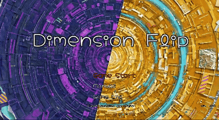
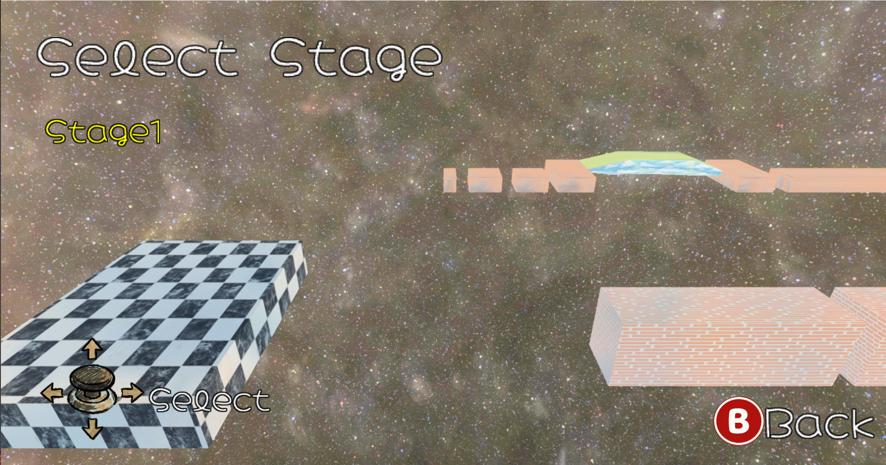
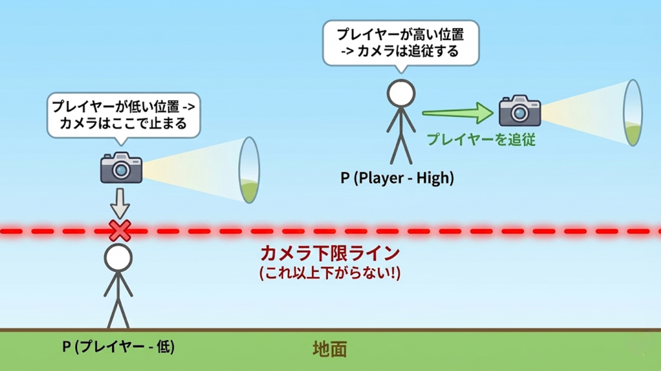

<link rel="stylesheet" href="style.css">

# DimensionFlip  
## 2D視点と3D視点を切り替えて進むアクションゲーム

## gif.1 タイトル画面

 

# 目次

### 1. [プロフィール](#1プロフィール)
### 2. [作品概要](#2作品概要)
### 3. [制作形式と担当箇所](#3制作形式と担当箇所)
### &emsp; 3-1. [制作形式](#3-1制作形式)
### &emsp; 3-2. [担当箇所](#3-2担当箇所)
### 4. [ゲームの特徴](#4ゲームの特徴)
### &emsp; 4-1. [作品の核](#4-1作品の核)
### &emsp; 4-2. [2D / 3D視点切り替えによる攻略](#4-2-2d--3d視点切り替えによる攻略)
### &emsp; 4-3. [ステージ構成](#4-3ステージ構成)
### 5. [操作方法](#5操作方法)
### &emsp; 5-1. [基本操作](#5-1基本操作)
### &emsp; 5-2. [推奨確認ルート](#5-2推奨確認ルート)
### 6. [ゲーム進行とステージ紹介](#6ゲーム進行とステージ紹介)
### &emsp; 6-1. [タイトルからステージ選択まで](#6-1タイトルからステージ選択まで)
### &emsp; 6-2. [TutorialStage](#6-2tutorialstage)
### &emsp; 6-3. [NormalStage](#6-3normalstage)
### &emsp; 6-4. [BossStage](#6-4bossstage)
### 7. [技術的工夫点](#7技術的工夫点)
### &emsp; 7-1. [カメラ制御の設計](#7-1カメラ制御の設計)
### &emsp; 7-2. [Strategy Patternによるカメラ処理の分離](#7-2strategy-patternによるカメラ処理の分離)
### &emsp; 7-3. [Factory Patternによる敵生成処理の整理](#7-3factory-patternによる敵生成処理の整理)
### &emsp; 7-4. [State Patternによる状態管理](#7-4state-patternによる状態管理)
### &emsp; 7-5. [Singleton Patternによる管理クラスの統一](#7-5singleton-patternによる管理クラスの統一)
### 8. [提出・確認情報](#8提出確認情報)
### 9. [今後の展望](#9今後の展望)
### 10. [リンク集](#10リンク集)

 

---

# 1.プロフィール

* ## 氏名:
  ## &emsp; 山口 隼（ヤマグチ ハヤト）

* ## 所属:
  ## &emsp; 河原電子ビジネス専門学校 ゲームクリエイター科 27卒

* ## 希望職種:
  ## &emsp; プログラマ

* ## 強み:
  ## &emsp; C++を用いたゲーム制作において、カメラ制御・状態管理・敵生成処理などを設計し、ゲームの仕組みを実装することを強みとしています。  
  ## &emsp; 本作品では、2D視点と3D視点を切り替えるゲーム性を成立させるため、カメラ制御、ステージ進行、敵生成、プレイヤー制御を中心に実装しました。

* ## Email:
  ## &emsp; CA01244029@st.kawahara.ac.jp

 

---

# 2.作品概要

* ## 作品名:
  ## &emsp; DimensionFlip

* ## ジャンル:
  ## &emsp; 2D / 3D視点切り替えアクションゲーム

* ## 使用言語:
  ## &emsp; C++

* ## 開発環境:
  ## &emsp; Visual Studio 2022  
  ## &emsp; 学内エンジン

* ## 開発ツール:
  ## &emsp; GitHub  
  ## &emsp; Fork

* ## 対応環境:
  ## &emsp; Windows 11

* ## 推奨操作:
  ## &emsp; Xbox系コントローラー

* ## キーボード操作:
  ## &emsp; 対応

* ## プレイ人数:
  ## &emsp; 1人

* ## 開発期間:
  ## &emsp; 2025年9月 〜 現在進行中

 

---

# 3.制作形式と担当箇所

## 3-1.制作形式

* ## 個人制作
  ## &emsp; 企画、実装、ステージ構成、カメラ制御、敵生成、ポートフォリオ作成を担当しました。

 

## 3-2.担当箇所

* ## 2D / 3D視点切り替えシステムの実装
* ## カメラ制御の設計・実装
* ## 視点切り替え許可エリアの管理
* ## ステージ進行管理
* ## プレイヤー制御
* ## 敵キャラクターの生成処理
* ## ステージごとの遷移処理
* ## UI・操作説明・ポートフォリオ整理

 

---

# 4.ゲームの特徴

## 4-1.作品の核

## DimensionFlipは、2D視点と3D視点を切り替えながらステージを進むアクションゲームです。

## 2D視点では横スクロールに近い感覚で進行し、3D視点では奥行き方向への移動や回り込みが可能になります。

## 本作品では、視点切り替えを単なるカメラ演出ではなく、移動ルートの発見・障害物の突破・敵回避に使うゲーム性として実装しました。

 

## gif.2 2D / 3D視点切り替えを使ったステージ進行

 

## 4-2.2D / 3D視点切り替えによる攻略

## 2D視点では、奥行き方向の情報が制限されるため、ステージを横方向に進むアクションとして見せています。

## 一方で、3D視点に切り替えることで、2D視点では分かりにくい奥行き方向のルートや回避経路を確認できます。

## 想定している攻略体験は以下の通りです。

* ## 2D視点では進みにくい場所を、3D視点で回り込む
* ## 3D視点で地形の位置関係を確認し、2D視点でジャンプアクションを行う
* ## 敵や障害物に対して、視点を切り替えて安全なルートを探す

 

## 4-3.ステージ構成

## 本作品には、TutorialStage、NormalStage、BossStageの3種類のステージがあります。

* ## TutorialStage:
  ## &emsp; 基本操作とゲーム全体の流れを確認できます。

* ## NormalStage:
  ## &emsp; 2D / 3D視点切り替えを使ったステージ攻略を確認できます。

* ## BossStage:
  ## &emsp; 視点切り替えと戦闘を組み合わせた場面を確認できます。

 

---

# 5.操作方法

## 5-1.基本操作

## 本作品はXbox系コントローラーでのプレイを推奨しています。  
## キーボード操作にも対応していますが、操作感はコントローラー基準で調整しています。

 

## 5-2.推奨確認ルート

## 初見で確認する場合は、以下の順番で見ると作品の特徴が伝わりやすくなります。

1. ## タイトル画面で GameStart を選択
2. ## ステージ選択画面へ進む
3. ## TutorialStageを選択
4. ## 2D / 3D視点切り替えを使ってステージを進行
5. ## 視点切り替えによる移動ルートやギミック突破を確認
6. ## 余裕があれば NormalStageとBossStageも確認

 

---

# 6.ゲーム進行とステージ紹介

## 6-1.タイトルからステージ選択まで

<video src="./Portfolio_Video/titleAction_StageSelectScene.mp4" controls width="100%"></video>

## video.1 タイトル画面からステージ選択まで

## タイトル画面では、GameStart、Manual、GameEndを選択できます。  
## GameStartを選択するとステージ選択画面に進み、プレイしたいステージを選択できます。  
## Manualでは操作方法を確認でき、GameEndではゲームを終了できます。

 

## 6-2.TutorialStage

<video src="./Portfolio_Video/PlayTutorialStage.mp4" controls width="100%"></video>

## video.2 TutorialStage

## TutorialStageでは、移動、ジャンプ、視点切り替えなど、ゲーム全体の基本操作を確認できます。  
## 初めてプレイする場合でも、ゲームの流れを理解しやすいステージとして配置しています。

 

## 6-3.NormalStage

## NormalStageでは、2D / 3D視点切り替えを使いながらステージを進みます。  
## 敵やギミックが配置されているため、どのタイミングで視点を切り替えるかが重要になります。  
## 本作品の核となる「視点切り替えによる攻略」を最も確認しやすいステージです。

 

## 6-4.BossStage

## gif.3 ボス登場カットイン
## ボス戦は別動画で解説をしています。
## https://youtu.be/FVOEsfokTfM?si=_2CNayQ2Ri96qFfP
## BossStageでは、カメラを切り替えながら攻撃を避け、ボスに攻撃を与えます。  
## 通常ステージとは異なるカメラ制御を行い、視点切り替えと戦闘を組み合わせた体験を目指しています。

 

---

# 7.技術的工夫点

## 7-1.カメラ制御の設計

## ■ 課題

## 2D視点と3D視点では、カメラに求められる役割が異なります。  
## 2D視点ではステージ全体の見通し、3D視点では奥行き方向の移動確認が必要になります。  
## これらを1つの処理としてまとめると、条件分岐が増え、カメラクラスが肥大化する問題がありました。

## ■ どう工夫したか

## カメラ本体を画面中央に配置し、プレイヤーが追従ラインを上下した分だけカメラが追従するようにしました。  
## また、斜面の移動にも対応し、プレイヤーの高さ変化に合わせて視点が追従するように調整しました。

## ■ 結果

## ステージ全体の視認性を確保しつつ、プレイヤーの進行に合わせて自然にカメラを動かせるようになりました。

 

---

## 7-2.Strategy Patternによるカメラ処理の分離

## 作品内での使用箇所:
## &emsp; 2D / 3Dカメラの切り替えロジック

## ■ 課題

## 当初はカメラクラスに2D視点、3D視点、ボス戦用カメラなどの処理を直接実装していました。  
## そのため、機能を追加するほど条件分岐が増え、処理の見通しが悪くなる問題がありました。

## ■ どう工夫したか

## Strategy Patternを用いて、カメラの振る舞いを状況ごとに分離しました。  
## 2D視点、3D視点、ボス戦など、状況に応じたカメラ制御を差し替えられる構成にしました。

## ■ 結果

## カメラクラスの肥大化を防ぎ、視点ごとの処理を個別に修正しやすくなりました。  
## また、ボス戦専用カメラなどを追加する際も、既存の2D / 3Dカメラ処理への影響を抑えられるようになりました。

 

---

## 7-3.Factory Patternによる敵生成処理の整理

## 作品内での使用箇所:
## &emsp; 敵キャラクターの生成方式

## ■ 課題

## 敵の種類が増えるたびにステージクラス内のswitch文が増え、ステージクラスの責務が大きくなっていました。  
## また、敵ごとの初期化処理がステージ側に増えることで、コードの見通しが悪くなる問題がありました。

## ■ どう工夫したか

## Factory Patternを用いて、敵の生成責務をFactoryクラスに分離しました。  
## ステージ側では、敵の種類と生成座標を指定するだけで生成できるようにしました。

## ■ 結果

## ステージクラスが敵の詳細な生成処理を持たなくなり、ステージ側の処理を整理できました。  
## 敵の種類を追加する際も、修正箇所を限定しやすくなりました。

 

---

## 7-4.State Patternによる状態管理

## 作品内での使用箇所:
## &emsp; Playerクラス / Enemyクラス

## ■ 課題

## PlayerやEnemyは、移動、ジャンプ、攻撃、被弾など複数の状態を持ちます。  
## これらを1つのクラス内で条件分岐だけで管理すると、処理が複雑になり、修正時の影響範囲が広くなります。

## ■ どう工夫したか

## State Patternを用いて、状態ごとの振る舞いを分離しました。  
## PlayerとEnemyの状態をそれぞれ管理し、状態ごとに処理を切り替えられる構成にしました。

## ■ 結果

## 状態ごとの処理を確認しやすくなり、デバッグや機能追加を行いやすくなりました。

 

---

## 7-5.Singleton Patternによる管理クラスの統一

## 作品内での使用箇所:
## &emsp; SceneManager / StageManager などの管理クラス

## ■ 課題

## シーン管理やステージ管理など、複数のクラスから参照される処理があります。  
## 呼び出し方が統一されていないと、処理の流れが分かりにくくなります。

## ■ どう工夫したか

## SceneManagerやStageManagerなどの管理クラスにSingleton Patternを使用し、アクセス方法を統一しました。

## ■ 結果

## シーン遷移やステージ管理を複数のクラスから呼び出しやすくなり、ゲーム全体の管理処理を整理できました。

 

---

# 8.提出・確認情報

* ## 起動方法:
  ## &emsp; `Game.exe` を起動してください。

* ## 推奨環境:
  ## &emsp; Windows 11  
  ## &emsp; Xbox系コントローラー推奨  
  ## &emsp; キーボード操作対応

* ## 確認してほしいステージ:
  ## &emsp; 最初にNormalStageを確認してください。  
  ## &emsp; 理由は、2D / 3D視点切り替えを使った攻略要素が最も伝わりやすいためです。

* ## 既知の不具合:
  ## &emsp; 提出時点で把握している進行不能の既知不具合はありません。

 

---

# 9.今後の展望

* ## 2D / 3D視点切り替えギミックの強化
  ## &emsp; 現状の視点切り替え要素を、さらにステージ攻略へ結びつける予定です。  
  ## &emsp; 2D視点では進めない場所を3D視点で回り込む、3D視点で位置関係を確認して2D視点でアクションするなど、視点切り替えを使う理由をより明確にします。

* ## BossStageの改修
  ## &emsp; ボス戦では、視点切り替えによって回避ルートや攻撃チャンスが変化するように調整し、通常ステージの要素とより強く結びつけます。

* ## 提出物の整理
  ## &emsp; 企業提出時に確認しやすいよう、実行ファイル、README、ポートフォリオ、動画リンクを整理した提出フォルダを作成します。

 

---

# 10.リンク集

* ## YouTube:
  ## &emsp; [プレイ動画はこちら](https://youtu.be/_fvf5sKiPTE?si=IzBmCe7CpZoNcOUo)

* ## GitHub:
  ## &emsp; [Dimensional-Flip](https://github.com/YamaguchiHayato/Dimensional-Flip)

* ## Portfolio:
  ## &emsp; [DimensionFlip Portfolio](https://yamaguchihayato.github.io/DimensionFlip-Portfolio.github.io/)

* ## ROM:
  ## &emsp; [ダウンロードはこちら](https://drive.google.com/file/d/1wA01RpSKpDIp1yL_sSOlJwel9cVUqhps/view?usp=drive_link)

* ## 過去作品（チーム制作）:
  ## &emsp; [過去作品動画はこちら](https://youtu.be/8DWuriwGJ-k?si=JC8OAdokIJmdOh5m)

 

---

## 宛先

### 学校法人河原学園 河原電子ビジネス専門学校 ゲームクリエイター科 ゲームコース 3年制
### 2年 山口 隼

* ## 学内アドレス:
  ## &emsp; CA01244029@st.kawahara.ac.jp